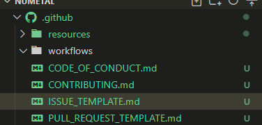

# NU-METAL.NET

## Welcome to the Github repo for nu-metal.net !
nu-metal.net is a open source collaborative project to preserve and nourish the active nu metal community alive and well today
The aim here is to have a searchable site that contains a page for each band/member of/contributor to nu-metal throughout it's existance and provide as much information as possible for each.

<h2>Take a look at contributing</h2>

<a href="https://github.com/cainba/numetal/blob/master/.github/CONTRIBUTING.md">-->CONTRIBUTING.md<--</a>

